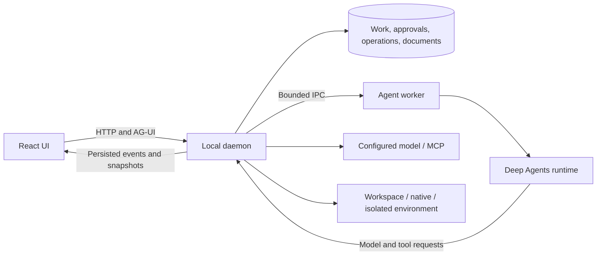

# Architecture and file placement

Rocky is an npm workspace containing a local web UI, an authoritative daemon, and an agent worker. The shared runtime builds one Deep Agents execution path for normal work, native children, reflection, and evaluation.

The daemon owns admission, scope, credentials, approvals, and operation effects. Workers request capabilities through validated IPC. UI state, tool text, and model output cannot authorize effects. Native children share the applicable root budgets and permissions; they do not introduce a separate durable scheduler.

Work state and operation receipts use local SQLite. Native graph checkpoints have a separate persistence boundary. Streams present events and reconnectable snapshots; completion comes from the daemon's recorded outcome. Uncertain external effects require reconciliation before retry.

## File placement

| Directory                     | Put here                                                   | Boundary                                             |
| ----------------------------- | ---------------------------------------------------------- | ---------------------------------------------------- |
| `apps/web/src/`               | UI panels, interaction state, presentation adapters        | No direct database access or effect authorization    |
| `apps/daemon/src/`            | HTTP handlers, domain services, stores, effect dispatch    | Owns durable Work and permission decisions           |
| `apps/agent-worker/src/`      | Worker entry point and IPC lifecycle                       | Runs under daemon-issued identity                    |
| `packages/agent-runtime/src/` | Agent factory, native tools, model and evaluation adapters | Single runtime assembly                              |
| `packages/contracts/src/`     | DTO/schema definitions shared by processes                 | Validate public and IPC input at boundaries          |
| `tests/`                      | Unit and service integration tests (`*.test.ts`)           | Isolated temporary data and deterministic providers  |
| `tests/e2e/`                  | Browser flows (`*.spec.ts`) and browser fixtures           | Verify actual user-visible behavior                  |
| `fixtures/`                   | Explicit synthetic model/MCP/evaluation inputs             | No credentials, user records, or paid defaults       |
| `scripts/`                    | Repository tooling and command entry points                | Core commands use Node/npm                           |
| `assets/rocky/`               | Editable vectors and provenance                            | Preserve hashes and rights-review status             |
| `docs/adr/`                   | Numbered architectural decisions                           | Record the choice and its consequences               |
| `docs/implementation/`        | Dated verification and implementation records              | Distinguish platform, mode, outcome, and limitations |
| `specs/rocky/`                | Requirements and acceptance contracts                      | Preserve IDs and the existing task DAG               |

Keep related modules near their existing domain. Introduce a new workspace only for a real package boundary, not to wrap a single component. Current runtime imports and public paths remain stable during documentation cleanup.

## Generated and private files

`dist/`, `node_modules/`, `coverage/`, `test-results/`, and `playwright-report/` are generated and ignored. `.rocky*/` directories contain local development or verification state and are ignored. They may remain on disk without belonging to the public repository.

Production data defaults to the platform's local application data directory; see the [user guide](user-guide.en.md). Never move runtime data into a tracked directory to make a test reproducible. Publish a synthetic fixture and a reviewed result instead.

## Further reading

- [Architectural decisions](adr/README.md)
- [Product contracts](../specs/rocky/ROCKY_GREENFIELD_SPEC.md)
- [Security boundaries](../SECURITY.md)
- [Historical implementation notes](implementation/README.md)
